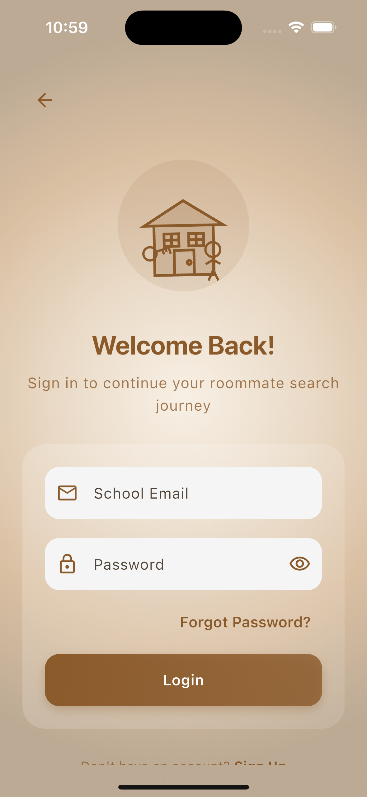
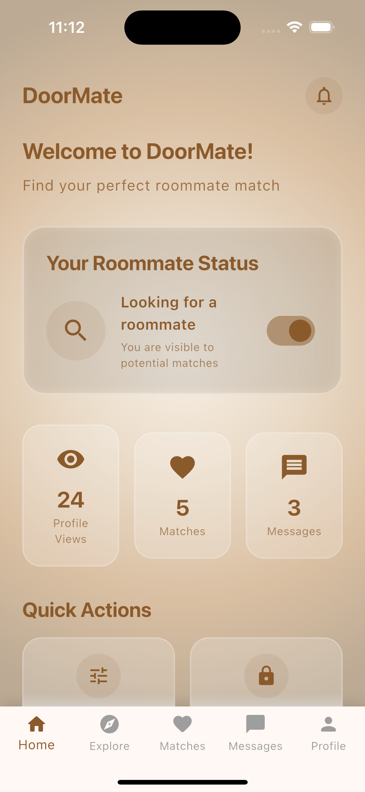
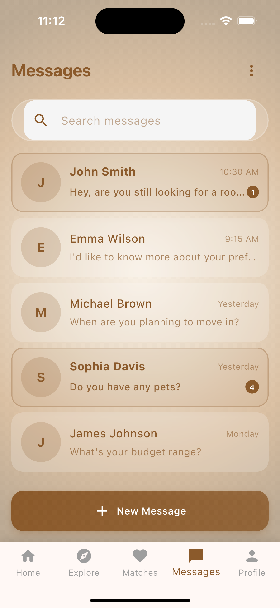
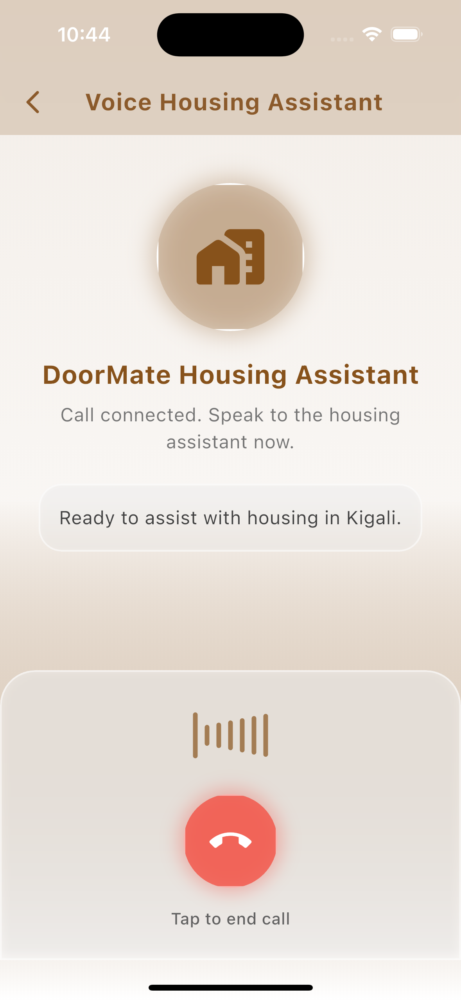
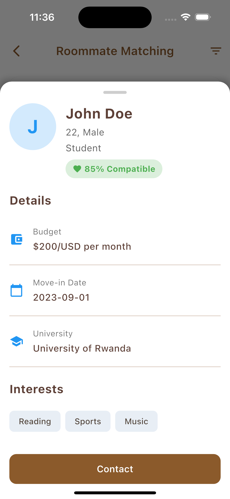

# DoorMate

DoorMate is a comprehensive housing platform that helps students find accommodations and roommates in Kigali, Rwanda.

## Features

- Voice-enabled AI assistant for housing search
- Real-time chat with property owners
- Roommate matching system
- Property listings with detailed information
- User authentication and profile management
- Multi-language support

## Screenshots

### Mobile App Interface

<div align="center">
  <div style="display: flex; flex-wrap: wrap; gap: 20px; justify-content: center;">
    
    
    
  </div>
  
  <div style="display: flex; flex-wrap: wrap; gap: 20px; justify-content: center; margin-top: 20px;">
    
    
    
  </div>
</div>

### Key Features Showcase

<div align="center">
  <div style="display: flex; flex-wrap: wrap; gap: 20px; justify-content: center;">
    
    
    
  </div>
</div>

### Core Functionality
- Student verification system
- AI-powered roommate matching
- In-app messaging
- Profile management
- Preference-based searching

### Security Features
- Multi-factor authentication
- Student ID verification
- Secure messaging
- Privacy controls
- Real-time safety monitoring

### User Features
- Customizable preferences
- Budget matching
- Location-based search
- Academic schedule compatibility
- Cultural preference matching

## Technology Stack

### Frontend
- React Native
- TensorFlow.js
- Redux for state management
- React Navigation

### Backend
- Python
- FastAPI
- MongoDB
- JWT Authentication

### AI/ML
- TensorFlow for AI-driven matching
- Natural Language Processing (NLP) for sentiment analysis
- Machine Learning for predictive modeling
- Python


### Cloud Services
- AWS EC2
- MongoDB Atlas
- AWS S3
- CloudWatch

## Installation

1. Clone the repository
```bash
git clone https://github.com/jefftrojan/doormate.git
cd doormate
```

2. Install dependencies
```bash
# Install frontend dependencies
cd client
npm install

# Install backend dependencies
cd ../server
npm install
```

3. Configure environment variables
```bash
# Create .env file in server directory
cp .env.example .env

# Create .env file in client directory
cp .env.example .env
```

4. Start the development servers
```bash
# Start backend server
cd server
npm run dev

# Start frontend development
cd client
npm start
```


https://drive.google.com/drive/folders/106fcSgZSLE7lJ4A_IywHvyr50mux8PpK?usp=sharing - Link to the APK file and Demo

## Project Structure
```
doormate/
├── Mobile_Client/                 # React Native application
│   ├── src/
│   │   ├── components/    # Reusable components
│   │   ├── screens/       # Screen components
│   │   ├── services/      # API services
│   │   └── utils/         # Utility functions
│   └── tests/             # Frontend tests
├── Server/                 # Node.js backend
│   ├── src/
│   │   ├── controllers/   # Request handlers
│   │   ├── models/        # Database models
│   │   ├── routes/        # API routes
│   │   └── utils/         # Utility functions
│   └── tests/             # Backend tests
└── docs/                  # Documentation
```

## API Documentation

### Authentication Endpoints
- POST /api/auth/register
- POST /api/auth/login
- POST /api/auth/verify

### Profile Endpoints
- GET /api/profile
- PUT /api/profile
- GET /api/preferences
- PUT /api/preferences

### Matching Endpoints
- GET /api/matches
- POST /api/matches/:id/accept
- POST /api/matches/:id/reject

### Chat Endpoints
- GET /api/chats
- POST /api/chats/:id/messages
- GET /api/chats/:id/messages

## Contributing
1. Fork the repository
2. Create your feature branch (`git checkout -b feature/AmazingFeature`)
3. Commit your changes (`git commit -m 'Add some AmazingFeature'`)
4. Push to the branch (`git push origin feature/AmazingFeature`)
5. Open a Pull Request

## Testing
```bash
# Run frontend tests
cd client
npm test

# Run backend tests
cd server
npm test
```

## License
This project is licensed under the MIT License - see the [LICENSE.md](LICENSE.md) file for details.

## Contact

Project Link: [https://github.com/jefftrojan/doormate](https://github.com/jefftrojan/doormate)

## Acknowledgments
- African Leadership University
- David Neza Tuyishimire (Project Supervisor)
